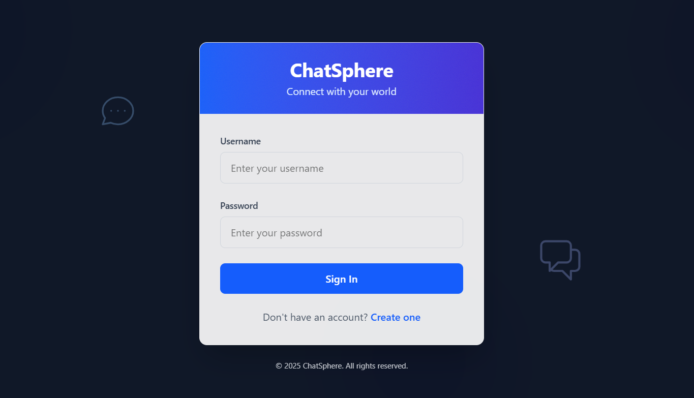
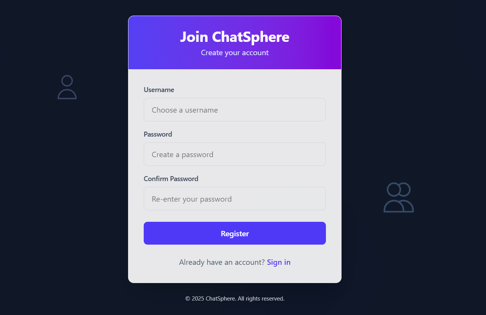
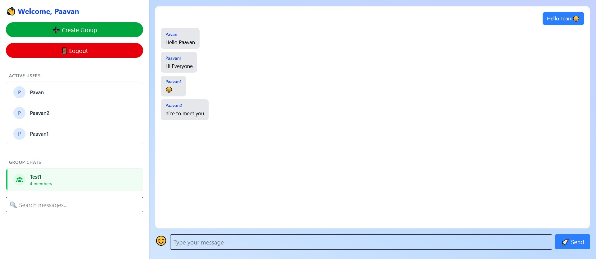
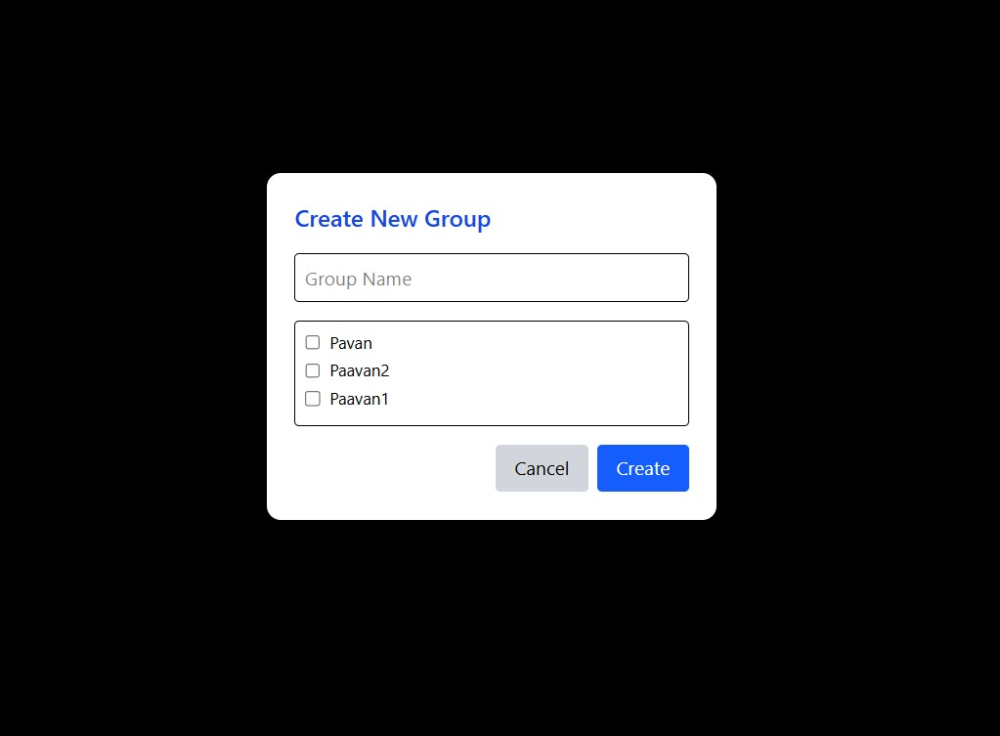

# 💬 ChatSphere

**ChatSphere** is a full-stack real-time chat application built with React, Node.js, Express, MongoDB, and Socket.IO. It supports both private messaging and group chats with persistent chat history, emoji support, and modern UI design.

---

## 🚀 Features

- 🔐 User authentication (login/register)
- 💬 Private one-to-one chat
- 👥 Group chat with multiple users
- 🧠 Real-time messaging using Socket.IO
- 📦 Chat history persistence in MongoDB
- 😀 Emoji support using `emoji-mart`
- 🔍 Message search/filter in chat window
- ⚡ Toast notifications for new messages
- 🔄 Persist selected chat (even after refresh)

---

## 🧱 Tech Stack

### Frontend:
- React.js
- TailwindCSS
- Socket.IO Client
- Axios
- Emoji Mart
- React Toastify

### Backend:
- Node.js
- Express.js
- MongoDB (with Mongoose)
- Socket.IO
- Bcrypt (for password hashing)
- JSON Web Tokens (JWT)

---

## 🖼️ UI Preview

| Login | Register | Chat Window | Group Creation |
|-------|----------|--------------|------------|
|  |  |  |  |


---

## 🛠️ Installation & Setup

### Prerequisites
- Node.js (v16 or higher recommended)
- npm (comes with Node.js)
- MongoDB (local or MongoDB Atlas)

### Project Structure
- `src/Backend/` — Node.js/Express backend (API, WebSocket, MongoDB)
- `src/Frontend/` — React frontend (Vite)

### 1. Clone the Repository

```bash
git clone https://github.com/yourusername/Real-Time_ChatApplication.git
cd Real-Time_ChatApplication
```

### 2. Install Dependencies

#### Backend
```bash
cd server
npm install
npm run dev
```

Create a `.env` file inside `server/`:

```env
PORT=5000
MONGO_URI=your_mongodb_connection_string
JWT_SECRET=your_jwt_secret
```

#### Frontend
```bash
cd client
npm install
npm start
```

Ensure the server is running at `http://localhost:5000`.

---

## 📁 Project Structure

```
Real_time_chat_app/
│
├── src/
│   ├── Backend/           # Node.js/Express Backend
│   │   ├── app.js         # Main server file
│   │   ├── Models/        # MongoDB schemas
│   │   │   ├── User.js
│   │   │   ├── Message.js
│   │   │   └── Group.js
│   │   ├── Routes/        # API routes
│   │   │   ├── Auth.js
│   │   │   ├── Messages.js
│   │   │   └── Group.js
│   │   └── package.json
│   │
│   ├── Frontend/          # React Frontend
│   │   └── pages/         # React components
│   │       ├── Login.jsx
│   │       ├── Register.jsx
│   │       └── Chat.jsx
│   │
│   ├── App.jsx            # Main React component
│   ├── App.css
│   ├── main.jsx           # React entry point
│   ├── index.css
│   └── assets/            # Static assets
│       ├── react.svg
│       ├── v1.mp4
│       └── v2.mp4
│
├── images/                # UI preview images
│   ├── g1.png
│   ├── im1.png
│   ├── im2.png
│   ├── Loginchatsphere.png
│   └── registerchatsphere.png
│
├── public/                # Public assets
│   └── vite.svg
│
├── package.json           # Frontend dependencies
├── package-lock.json
├── vite.config.js         # Vite configuration
├── eslint.config.js       # ESLint configuration
└── README.md
```

---

## ✨ Future Enhancements

* 🖼️ Profile pictures and status indicators
* 📱 Responsive mobile design
* 📌 Pin important messages
* 📁 File sharing
* 🔒 End-to-end encryption

---

## 👨‍💻 Developed By

**Paavan Tandel**
Final Year CSE | GCET
[GitHub](https://github.com/paavantandel/) • [LinkedIn](https://linkedin.com/in/paavan-tandel-014988265/)

