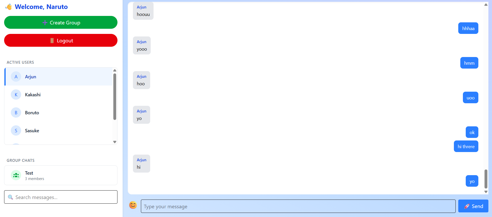
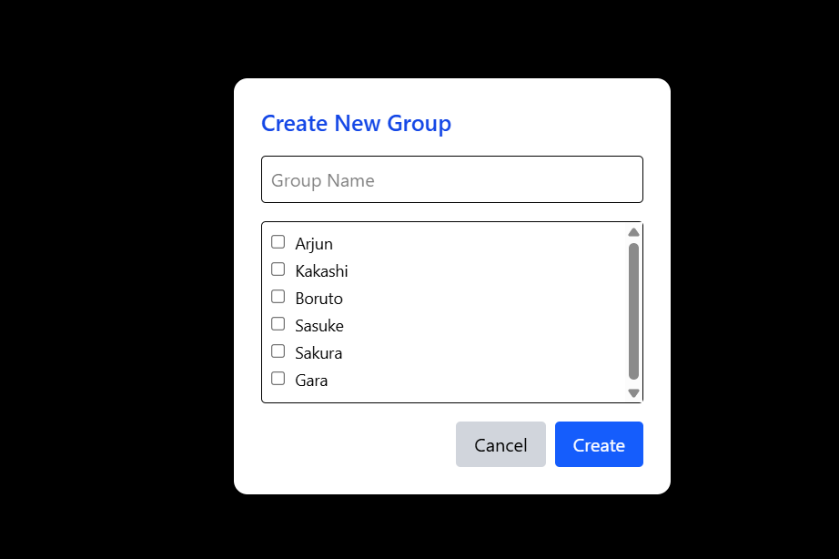

# 💬 ChatSphere

**ChatSphere** is a full-stack real-time chat application built with React, Node.js, Express, MongoDB, and Socket.IO. It supports both private messaging and group chats with persistent chat history, emoji support, and modern UI design.

---

## 🚀 Features

- 🔐 User authentication (login/register)
- 💬 Private one-to-one chat
- 👥 Group chat with multiple users
- 🧠 Real-time messaging using Socket.IO
- 📦 Chat history persistence in MongoDB
- 😀 Emoji support using `emoji-mart`
- 🔍 Message search/filter in chat window
- ⚡ Toast notifications for new messages
- 🔄 Persist selected chat (even after refresh)

---

## 🧱 Tech Stack

### Frontend:
- React.js
- TailwindCSS
- Socket.IO Client
- Axios
- Emoji Mart
- React Toastify

### Backend:
- Node.js
- Express.js
- MongoDB (with Mongoose)
- Socket.IO
- Bcrypt (for password hashing)
- JSON Web Tokens (JWT)

---

## 🖼️ UI Preview

| Login | Register | Private Chat | Group Chat |
|-------|----------|--------------|------------|
|  |  |  |  |


---

## 🛠️ Installation & Setup

### 1. Clone the repository

```bash
git clone https://github.com/yourusername/chatsphere.git
cd chatsphere
````

### 2. Setup the server

```bash
cd server
npm install
npm run dev
```

Create a `.env` file inside `server/`:

```env
PORT=5000
MONGO_URI=your_mongodb_connection_string
JWT_SECRET=your_jwt_secret
```

### 3. Setup the client

```bash
cd client
npm install
npm start
```

Ensure the server is running at `http://localhost:5000`.

---

## 📁 Project Structure

```
chatsphere/
│
├── client/             # React Frontend
│   ├── src/
│   │   ├── components/
│   │   │   └── Chat.jsx
│   │   └── App.jsx
│   └── ...
│
├── server/             # Node/Express Backend
│   ├── routes/
│   ├── models/
│   ├── controllers/
│   └── server.js
│
└── README.md
```

---

## ✨ Future Enhancements

* 🖼️ Profile pictures and status indicators
* 📱 Responsive mobile design
* 📌 Pin important messages
* 📁 File sharing
* 🔒 End-to-end encryption

---

## 👨‍💻 Developed By

**Arjun Sabu**
Final Year CSE | GEC Kottayam
[GitHub](https://github.com/arjunsabu300) • [LinkedIn](https://www.linkedin.com/in/arjun-sabu-8146122a5/)

---

```
